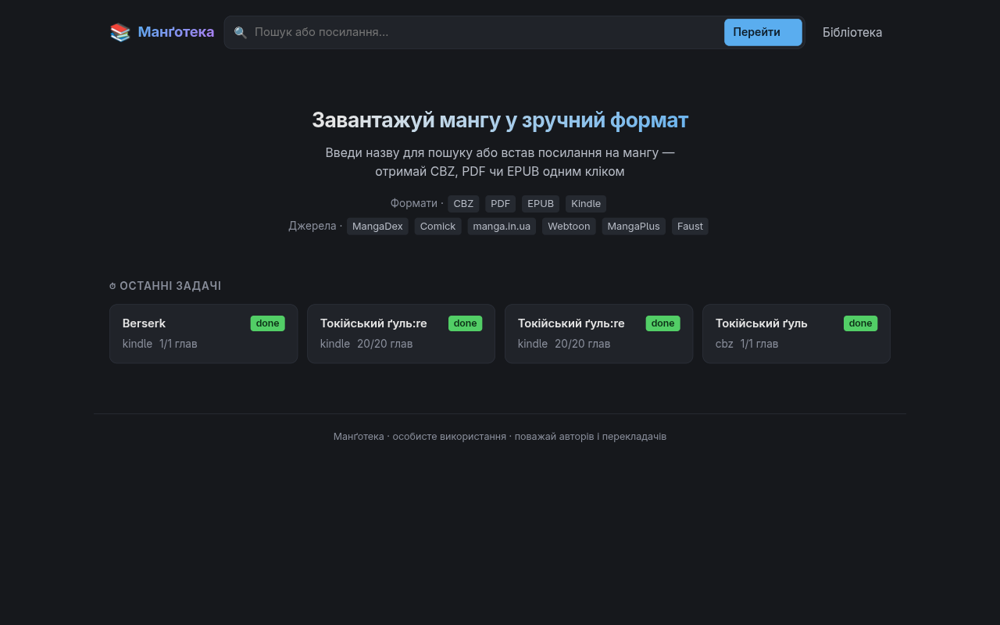
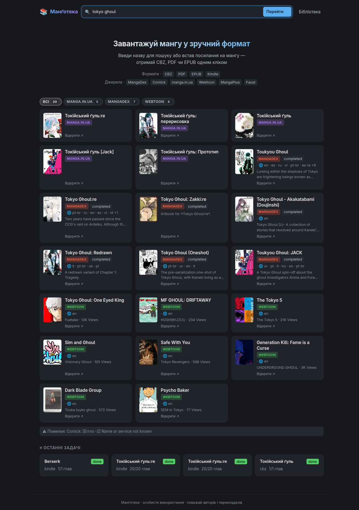
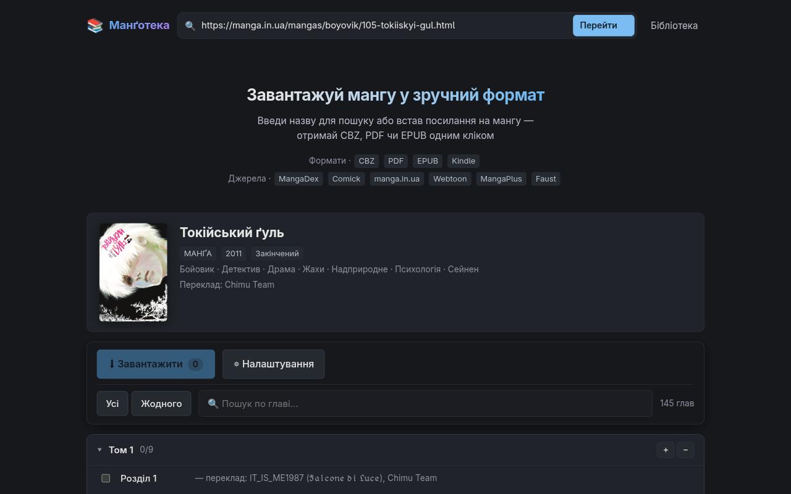
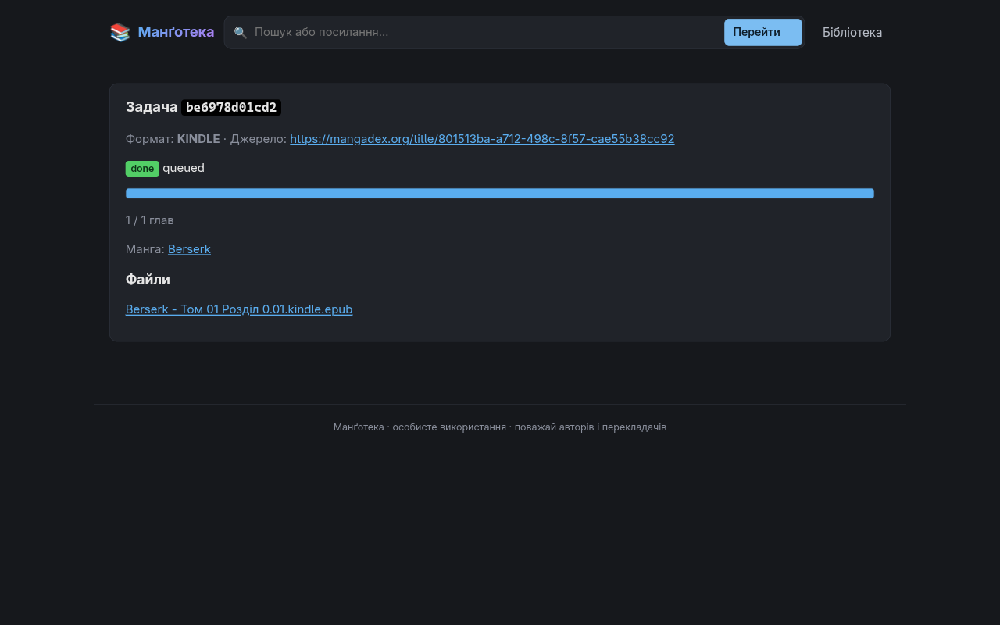
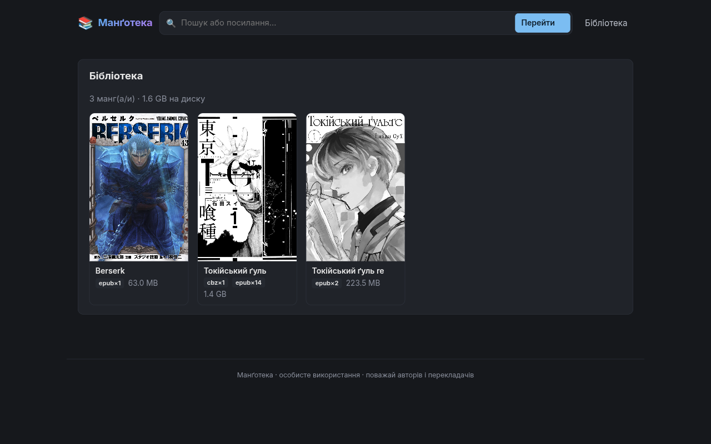

# Манґотека

Завантажує мангу з **6 джерел** у форматах **CBZ · PDF · EPUB · EPUB для Kindle**.
Два інтерфейси: веб-UI та CLI. Для локального запуску або деплою на VPS.



---

## Швидкий старт

```bash
docker compose up -d --build
# → http://localhost:8765
```

Бібліотека зберігається у `./data/library/` і переживає перезапуски контейнера.

```bash
docker compose down                         # зупинити
docker compose logs -f                      # логи
git pull && docker compose up -d --build    # оновлення
```

Порт за замовчуванням — `8765`. Змінити: `WEB_PORT=9000 docker compose up -d --build`.

---

## Джерела

| Джерело | URL |
|---|---|
| [manga.in.ua](https://manga.in.ua) | `manga.in.ua/mangas/…` або `manga.in.ua/chapters/…` |
| [faust-web.com](https://faust-web.com) | `faust-web.com/manga/…` |
| [MangaDex](https://mangadex.org) | `mangadex.org/title/…` |
| [Comick](https://comick.io) | `comick.io/comic/…` |
| [Webtoon](https://webtoons.com) | `webtoons.com/…` |
| [MangaPlus](https://mangaplus.shueisha.co.jp) | `mangaplus.shueisha.co.jp/…` |

---

## Веб-UI

### Пошук і вибір джерела

Введи назву — пошук іде одночасно по всіх 6 джерелах. Клікни на карточку щоб завантажити список глав.



### Список глав

Встав посилання на тайтл або главу — отримай метадані і повний список глав з розбивкою по томах.
Вибирай глави вручну або одразу весь том, обери формат і режим (`файл на главу` / `один файл на том`).



### Задача і прогрес

Завантаження йде у фоні. Сторінка оновлюється автоматично.
Кнопки управління: ⏸ Пауза · ■ Зупинити · ✕ Скасувати.
Якщо глава впала — кнопка 🔄 повторить тільки її (або всі помилкові одразу).



### Бібліотека

Всі завантажені файли зберігаються локально. Обкладинки беруться з метаданих або першої сторінки.



Після рестарту контейнера завершені задачі видно в історії, файли на диску зберігаються.

---

## Локальний запуск без Docker

Потрібно: Python ≥ 3.10. KCC потрібен тільки для формату Kindle.

```bash
python -m venv .venv && source .venv/bin/activate
pip install -e .
mangoteka-web          # веб-UI → http://localhost:8000
```

**KCC** (тільки для формату Kindle): у Docker вже вбудований. Нативно:

```bash
pip install "kindlecomicconverter @ git+https://github.com/ciromattia/kcc.git"
# або Arch: yay -S kcc
```

---

## CLI

```bash
mangoteka title   URL [OPTIONS]
mangoteka chapter URL [OPTIONS]
```

| Опція | За замовчуванням | Опис |
|---|---|---|
| `-o / --out` | `./out` | куди писати файли |
| `-f / --format` | `cbz` | `cbz` · `pdf` · `epub` · `kindle` |
| `-c / --concurrency` | `8` | паралельних завантажень |
| `--from N` | — | з глави N (тільки `title`) |
| `--to N` | — | по главу N включно (тільки `title`) |
| `--list-only` | — | показати список і вийти (тільки `title`) |

```bash
# Приклади
mangoteka title 'https://manga.in.ua/mangas/boyovik/105-tokiiskyi-gul.html' --from 1 --to 10
mangoteka title 'https://faust-web.com/manga/nazva' -f epub
mangoteka title 'https://mangadex.org/title/...' -f kindle
mangoteka chapter 'https://manga.in.ua/chapters/99999-rozdil-1.html'

mangoteka title 'https://...' --list-only   # показати глави без завантаження
```

---

## Формати виводу

| Формат | Чим | Примітки |
|---|---|---|
| **CBZ** | zip JPEG | читається будь-яким CBZ-ридером |
| **PDF** | img2pdf | лосслес, без EXIF-ротації |
| **EPUB** | ebooklib | фіксований layout, SVG-обгортка для масштабування |
| **EPUB Kindle** | KCC | оптимізовано для Send-to-Kindle |

---

## Структура

```
src/mangoteka/
├── _http.py           — RetryClient: спільний семафор + 429/Retry-After
├── scraper.py         — MangaClient (manga.in.ua) + make_client() factory
├── faust_scraper.py   — FaustClient (faust-web.com REST API)
├── mangadex_scraper.py
├── comick_scraper.py
├── webtoon_scraper.py
├── mangaplus_scraper.py
├── search.py          — search_all(): паралельний пошук по всіх джерелах
├── downloader.py      — паралельне завантаження, глобальний семафор, 429+Retry-After
├── converters.py      — CBZ / PDF / EPUB / Kindle EPUB + package_chapters()
├── cli.py             — Click CLI
└── web/
    ├── app.py         — FastAPI ендпойнти
    ├── jobs.py        — JobStore: стейт-машина + SQLite-персистентність
    ├── library.py     — бібліотека на диску
    ├── __main__.py    — точка входу mangoteka-web
    └── templates/     — Jinja2 + HTMX
```

---

## Налаштування

| Змінна | Дефолт | Опис |
|---|---|---|
| `MANGOTEKA_HOST` | `127.0.0.1` | bind-адреса (в Docker: `0.0.0.0`) |
| `MANGOTEKA_PORT` | `8000` | порт |
| `MANGOTEKA_DATA` | `./data` | де зберігаються бібліотека і `jobs.db` |
| `MANGOTEKA_RELOAD` | — | `1` для auto-reload у розробці |
| `WEB_PORT` | `8765` | зовнішній порт у docker-compose |

---

## Деплой на VPS

```bash
git clone <repo> mangoteka && cd mangoteka
docker compose up -d --build
```

Поверх — reverse-proxy для HTTPS (Caddy):

```caddy
manga.example.com {
    reverse_proxy localhost:8765
}
```

На безкоштовних tier'ах (Fly.io, Render) диск ефемерний — для постійного зберігання
приєднай volume / persistent disk до `/data`.

---

## Юридичне

Для особистого використання. Поважай авторів і перекладачів, підтримуй їх там, де можеш.
